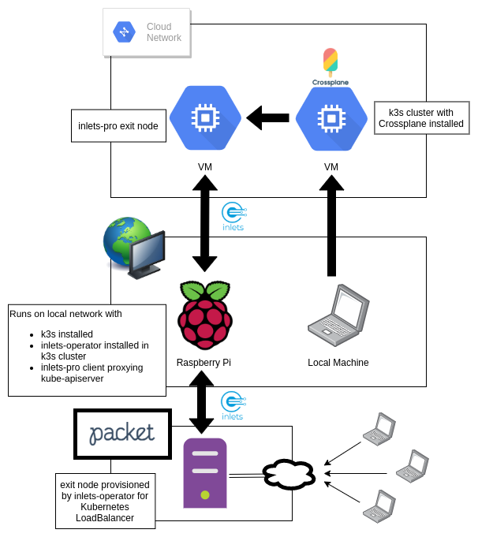

# Guide

This guide will take you through the steps followed in TBS[9] to:

1. Install "control" `k3s` cluster on a GCP VM using `k3sup`
2. Install Crossplane on the `k3s` "control" cluster using `k3sup`
3. Install "remote" `k3s` and `inlets-operator` on local Raspberry Pi using `k3sup`
4. Expose "remote" kube-apiserver on public internet using `inlets-pro` and a GCP VM for exit node
5. Connect to "control" cluster from local machine using `kubectl`
6. Inject "remote" cluster `kubeconfig` as `Secret` in "control" cluster
7. Schedule workloads to "remote" cluster from "control" cluster using `KubernetesTarget` and `KubernetesApplication`
8. View public endpoint on exit node provisioned by `inlets-operator` for Kubernetes `Service` deployed to "remote" cluster



## Attribution

The setup of the VM instance on GCP is very similar to the process described in this [post](https://starkandwayne.com/blog/trying-tiny-k3s-on-google-cloud-with-k3sup/), which I used to get started with `k3sup`.

All parts of the `k3sup` setup and usage are heavily influenced by the `k3sup` [docs](https://github.com/alexellis/k3sup) and personal blog posts by [Alex Ellis](https://blog.alexellis.io/). Many of the contributions to `k3sup` come from the [OpenFaas](https://www.openfaas.com/) community.

## Prerequisites

* [kubectl](https://kubernetes.io/docs/tasks/tools/install-kubectl/) installed
* An account and project on [GCP](https://cloud.google.com/)
* `gcloud` cli [installed](https://cloud.google.com/sdk/install)
* An account on [Packet](https://www.packet.com/)
* A Raspberry Pi on your local network

## Steps

### 1. Install `k3sup`

```
$ curl -sLS https://get.k3sup.dev | sh
$ sudo install k3sup /usr/local/bin/
```

### 2. Create a firewall rule on GCP

This will allow us to access the k3s API server using the `kubeconfig` that `k3sup` will generate for us.
```
$ gcloud compute firewall-rules create k3s --allow=tcp:6443 --target-tags=k3s

Creating firewall...⠧Created [https://www.googleapis.com/compute/v1/projects/.../global/firewalls/k3s].                                                                                  
Creating firewall...done.
NAME  NETWORK  DIRECTION  PRIORITY  ALLOW     DENY  DISABLED
k3s   default  INGRESS    1000      tcp:6443        False

```

### 3. Create a VM on GCP

This will be our `k3s` server node. We will only be provisioning a single VM as we will be running Crossplane on a single-node `k3s` cluster.
```
$ gcloud compute instances create control --machine-type n1-standard-1 --tags k3s

Created [https://www.googleapis.com/compute/v1/projects/.../zones/us-east1-b/instances/control].                                                                                         
NAME     ZONE        MACHINE_TYPE   PREEMPTIBLE  INTERNAL_IP  EXTERNAL_IP   STATUS
control  us-east1-b  n1-standard-1               10.142.0.2   35.237.38.70  RUNNING
```

We will be using the `EXTERNAL_IP` in the following steps, so go ahead and set it as an environment variable:
```
export EXTERNAL_IP=35.237.38.70
```

### 4. Configure local SSH for VM

Running the following command will add an SSH private key in `~/.ssh/google_compute_engine` that can be used to SSH into the VM.
```
$ gcloud compute config-ssh

You should now be able to use ssh/scp with your instances.
```

You can make sure that you are able to connect via SSH before moving forward:
```
$ ssh $(whoami)@$EXTERNAL_IP
```

### 5. Install `k3s` on the VM using `k3sup`

```
$ k3sup install --ip $EXTERNAL_IP --ssh-key ~/.ssh/google_compute_engine --user $(whoami)
```

You should see logs indicating `k3s` is being installed, and a `kubeconfig` file should be created in your current directory. To connect via `kubectl`, we can set the `KUBECONFIG` environment variable to the path of the `kubeconfig` file that `k3sup` created for us. Because we are going to have multiple `kubeconfig` files in this guide, go ahead and rename this one to `kubeconfig.control`.

```
$ mv kubeconfig kubeconfig.control
$ export KUBECONFIG=`pwd`/kubeconfig.control

$ kubectl get nodes -o wide

NAME      STATUS   ROLES    AGE     VERSION        INTERNAL-IP   EXTERNAL-IP   OS-IMAGE                       KERNEL-VERSION   CONTAINER-RUNTIME
control   Ready    master   5m55s   v1.17.2+k3s1   10.142.0.2    <none>        Debian GNU/Linux 9 (stretch)   4.9.0-11-amd64   containerd://1.3.3-k3s1
```

### 6. Install Crossplane using `k3sup`

```
$ k3sup app install crossplane --helm3
```

Once Crossplane is installed you should be able to see both `crossplane` and `crossplane-stack-manager` pods running in the `crossplane-system` namespace.

```
$ kubectl get pods -n crossplane-system

NAME                                        READY   STATUS    RESTARTS   AGE
crossplane-stack-manager-6d4bb54fd9-qjdgz   1/1     Running   0          102s
crossplane-58c4869546-bgg64                 1/1     Running   0          102s
```

### 7. Install `k3s` on Raspberry Pi using `k3sup`

This portion assumes that you already have a Raspberry Pi setup on your local network. If you do not, there are numerous [guides](https://www.raspberrypi.org/documentation/configuration/wireless/headless.md) available to get started with SSH access on your Raspberry Pi. If set up correctly, you should be able to SSH into your Raspberry Pi with username `pi` and the local IP.

```
$ ssh pi@192.168.1.84
```

Go ahead and set an evironment variable for the local `PI_IP`:

```
$ export PI_IP=192.168.1.84
```

We can install `k3s` in the same manner that we did on the VM, but by passing the IP and username of the Raspberry Pi:

```
$ k3sup install --ip $PI_IP --user pi --k3s-extra-args '--no-deploy traefik'
```

We should once again have a `kubeconfig` created in our directory. Run the same commands as we did above to change the name of the `kubeconfig` file and then take a look at the node(s) in our Raspberry Pi `k3s` cluster:

```
$ mv kubeconfig kubeconfig.remote
$ export KUBECONFIG=`pwd`/kubeconfig.remote

$ kubectl get nodes -o wide

NAME          STATUS   ROLES    AGE   VERSION        INTERNAL-IP    EXTERNAL-IP   OS-IMAGE                         KERNEL-VERSION   CONTAINER-RUNTIME
raspberrypi   Ready    master   15m   v1.17.2+k3s1   192.168.1.84   <none>        Raspbian GNU/Linux 10 (buster)   4.19.75-v7l+     containerd://1.3.3-k3s1
```

At this point, we may want to easily switch between our two `k3s` clusters. To enable this, we need to update both `kubeconfig.remote` and `kubeconfig.control` because `k3sup` sets the `kubeconfig` cluster, user, and context as `default`. Let's go ahead and change `default` to `remote` and `control` in each respective cluster:

```
$ sed -i 's/default/remote/g' kubeconfig.remote
$ sed -i 's/default/control/g' kubeconfig.control
```

Now we can merge both of our `kubeconfig` files:

```
$ export KUBECONFIG=merge:kubeconfig.control:kubeconfig.remote
```

Now if we check our contexts, we will see we are configured to talk to both:

```
$ kubectl config get-contexts

CURRENT   NAME      CLUSTER   AUTHINFO   NAMESPACE
*         control   control   control    
          remote    remote    remote 
```

To switch between them, simply use `kubectl config use-context remote` or `kubectl config use-context control`.

### 8. Install the [inlets-operator](https://github.com/inlets/inlets-operator) using `k3sup`

For this part you will need to create an account and a project on [Packet](https://www.packet.com/). Set `PACKET_PROJECT` to the Project ID of the project you want to use.

```
export PACKET_PROJECT=xxxxxxxxxxxx
```

Next, create an API token on Packet and store it in `packet-token.txt`. Now we can install the `inlets-operator` on with permissions to create exit nodes for us on Packet when ever we create a `Service` in the Raspberry Pi cluster.

```
$ k3sup app install inlets-operator --provider packet --region ewr1 --project-id $PACKET_PROJECT --token-file "./packet-token.txt"
``` 

### 9. Port-Forward the Kubernetes API Server using [inlets-pro](https://github.com/inlets/inlets-pro)

We are going to use `inlets` again to forward the Kubernetes API Server on the Raspberry Pi. To do so we are going to setup an exit node on GCP, similar to how we did earlier:

```
$ gcloud compute firewall-rules create k3s-inlets --allow=tcp:6443,tcp:8123 --target-tags=k3s-inlets

$ gcloud compute instances create piproxy --machine-type n1-standard-1 --tags k3s-inlets

NAME     ZONE        MACHINE_TYPE   PREEMPTIBLE  INTERNAL_IP  EXTERNAL_IP   STATUS
piproxy  us-east1-b  n1-standard-1               10.142.0.3   43.222.44.79  RUNNING
```

Now we can SSH into the machine as we did before, and set up inlets-pro.

```
$ export PI_PROXY_IP=43.222.44.79

$ ssh $(whoami)@$PI_PROXY_IP

$ curl -sLSf https://inletsctl.inlets.dev | sudo sh

$ sudo inletsctl download --pro

$ export TOKEN=mysupersecrettoken
$ export PI_PROXY_IP=43.222.44.79
$ export PI_IP=192.168.1.84

$ inlets-pro server --token $TOKEN --common-name $PI_PROXY_IP --remote-tcp $PI_IP
```

Now we need to setup the inlets-pro client on our Raspberry Pi. `inlets-pro` requires a license to use, but you can get a free trial by filling out [this form](https://docs.google.com/forms/d/e/1FAIpQLScfNQr1o_Ctu_6vbMoTJ0xwZKZ3Hszu9C-8GJGWw1Fnebzz-g/viewform?usp=sf_link).

```
$ ssh pi@$PI_IP

$ curl -sLSf https://inletsctl.inlets.dev | sudo sh

$ sudo inletsctl download --pro

$ export TOKEN=mysupersecrettoken
$ export PI_PROXY_IP=43.222.44.79
$ export LICENSE=contentsofmylicense

$ inlets-pro client --connect "wss://$PI_PROXY_IP:8123/connect" --token $TOKEN --license $LICENSE --tcp-ports "6443"
```

### 10. Create `kubeconfig.proxy` for connection through proxy server

We now should be able to connect to the Kubernetes API server through the exit node. Copy `kubeconfig.remote` to `kubeconfig.proxy` and change the IP address to `https://$PI_PROXY_IP:6443`, remove the `certificate-authority-data` field, and add `insecure-skip-tls-verify: true`.

### 11. Inject `kubeconfig.proxy` into a `Secret` and create `KubernetesTarget` in `control` cluster

First connect to our `control` cluster again:

```
$ kubectl config use-context control
```

Now inject the `kubeconfig.proxy` into a `Secret`:

```
$ export ENCODE=`base64 kubeconfig.proxy -w 0`

$ cat > secret.yaml <<EOF
apiVersion: v1
kind: Secret
metadata:
  name: pik8s
type: Opaque
data:
  kubeconfig: $ENCODE
EOF

$ kubectl apply -f secret.yaml
```

Then create a `KubernetesTarget` that references the `Secret`:

```
$ cat > target.yaml <<EOF
apiVersion: workload.crossplane.io/v1alpha1
kind: KubernetesTarget
metadata:
  name: pik8s
  labels:
    tbs: nine
spec:
  connectionSecretRef:
    name: pik8s
EOF

$ kubectl apply -f target.yaml
```

### 12. Schedule workloads to the Raspberry Pi using `KubernetesApplication`

```
$ cat > app.yaml <<EOF
apiVersion: workload.crossplane.io/v1alpha1
kind: KubernetesApplication
metadata:
  name: tbs-nine
  labels:
    app: tbs-nine
spec:
  resourceSelector:
    matchLabels:
      app: tbs-nine
  targetSelector:
    matchLabels:
      tbs: nine
  resourceTemplates:
    - metadata:
        name: tbs-nine-namespace
        labels:
          app: tbs-nine
      spec:
        template:
          apiVersion: v1
          kind: Namespace
          metadata:
            name: tbs-nine
EOF

$ kubectl apply -f app.yaml
```

### 13. Check to see that the `Namespace` is created on the Raspberry Pi

First, while still connected to the `control` cluster, check the status of the `KubernetesApplication`. If the `Namespace` has been created successfully on the Raspberry Pi cluster, the `STATUS` should be `Submitted`. 

```
$ kubectl get kubernetesapplicationresources

NAME                  TEMPLATE-KIND   TEMPLATE-NAME      CLUSTER   STATUS
tbs-nine-namespace    Namespace       tbs-nine           pik8s     Submitted 
```

Now let's check to see if the `Namespace` actually exists on the Raspberry Pi cluster:

```
$ kubectl config use-context remote
$ kubectl get namespaces

NAME              STATUS   AGE                                   
default           Active   32m                                   
kube-system       Active   32m                                   
kube-public       Active   32m                                   
kube-node-lease   Active   32m                              
tbs-nine          Active   62s
```

### 14. Schedule a workload with a `Service` to the Raspberry Pi and have `inlets-operator` create an exit node

Coming soon!


